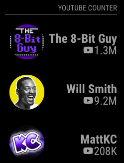
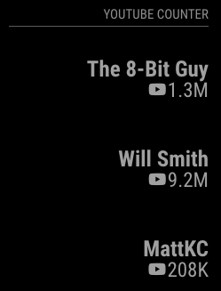
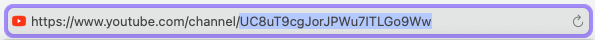

# MMM-YT-SubCount

This is a module for the [MagicMirror²](https://github.com/MichMich/MagicMirror/).

This module show the number of Youtube Subscriber on the MagicMirror. All you need is a Google Developer Account to activate the Youtube API. The API is limited to `10.000` Quota. Here, one API call is one Quota.

The YouTube API rounded the value down. For example a subscriber count of `12,345` will shown as `12.3K`. For more Information see [here](https://developers.google.com/youtube/v3/revision_history#release_notes_09_10_2019)

[](https://www.repostatus.org/#inactive)

Version 1.0.0

|  |  |
| :-------------------------------------------------------------------: | -------------------------------------------------------------------- |
|             YouTube Subscriber Counter with profile image             | YouTube Subscriber Counter without profile image                     |

## Installation

This module is pretty simple to set up. You simply need to clone the module into your modules folder (like other modules).

```
$ cd MagicMirror/modules
$ git clone https://github.com/choffmann/MMM-YT-SubCount.git
```

After you clone the repositories, you have to install the `node modules`

```
$ cd ./MMM-MMM-YT-SubCount
$ npm install
```

## Get your API Key

To use this Module, you need to activate the YouTube API from the Google Developer Console, see Step 2. → API Keys [Youtube Documentation](https://developers.google.com/youtube/registering_an_application#create_project)

1. Go to the [Google Developer Console](https://www.google.com/url?sa=t&rct=j&q=&esrc=s&source=web&cd=&ved=2ahUKEwiUwriR--HvAhVVhf0HHRBVB9EQFjAAegQIAxAD&url=https%3A%2F%2Fconsole.developers.google.com%2F%3Fhl%3Dde&usg=AOvVaw1vV9phF9_68m97-v1YVXsy) with your Google Account or create a new.
2. After logging in, go to `APIs & Services` left in the Burger Menu.
3. Go to `Library` an search for `YouTube Data API v3`
4. Enable this API. You should be redirect to the overview.
5. Create an API Key in the Menu `Credentails` → `+ CREATE CREDENTAILS`

## YouTube Channel

To display the subscribtion, you need to define which channel you want to display. You can also display multiple channels.
All you need is the Channel ID. You can find the Channel ID in the URL in YouTube.



## Using the module

To use this module, add the following configuration block to the modules array in the `config/config.js` file:

```js
var config = {
  modules: [
    {
      module: "MMM-YT-SubCount",
      header: "Youtube Counter",
      position: "top_right",
      config: {
        apiKey: "YOUR_API_KEY",
        showChannelImg: true,
        channelIds: [
          {
            id: "UC8uT9cgJorJPWu7ITLGo9Ww"
          },
          {
            id: "UCKuHFYu3smtrl2AwwMOXOlg"
          }
          // and so on...
        ]
      }
    }
  ]
};
```

## Configuration options

| Option           | Description                                                                                                 |
| ---------------- | ----------------------------------------------------------------------------------------------------------- |
| `apiKey`         | **_Required_** Your API Key goes here                                                                       |
| `channelIds`     | **_Required_** Put the Channel ids here in the Array <br><br> {<br>id: " CHANNEL_ID"<br>},                  |
| `showChannelImg` | **_Optional_** Display the channel profile image <br><br>**Type:** `boolean` <br>Default `true`             |
| `updateInterval` | **_Optional_** Refresh rate <br><br>**Type:** `int`(milliseconds) <br>Default 60000 milliseconds (1 minute) |
